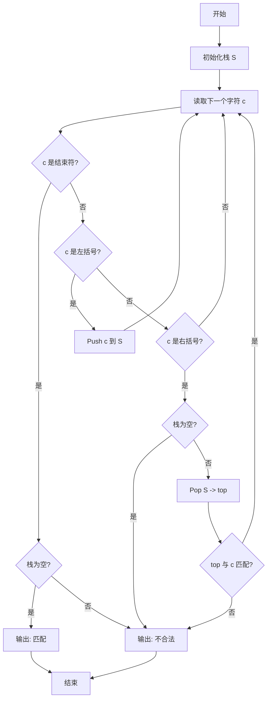
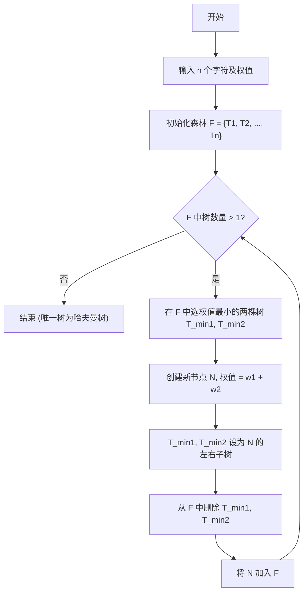

# 《数据结构》课程设计

<center>张正珂</center>
<center>计算机与软件学院，软件工程，2024级</center>

&nbsp;

**摘 要**：本报告详细阐述了三个数据结构课程设计任务的实现过程与结果。首先，利用栈结构实现了括号匹配的检验算法，能够有效识别嵌套括号序列的合法性；其次，基于哈夫曼树构建了编码与译码系统，实现了对文本数据的高效压缩与还原；最后，实现了十种常见的内部排序算法，并通过大量随机数据对比分析了它们在比较次数与移动次数上的性能差异。

**关键词**：栈；哈夫曼树；内部排序；算法分析

&nbsp;

## 第一章 括号匹配的检验

### 1.1 问题描述

假设表达式中允许有两种括号：圆括号和方括号，其嵌套的顺序随意，即 `(()[])` 或 `[([][])]` 等为正确格式，`[(])` 或 `((()]` 均为不正确的格式。本任务要求读入圆括号和方括号的任意序列，输出“匹配”或“此串括号匹配不合法”。

### 1.2 算法思想

该算法利用“栈”（Stack）这种后进先出（LIFO）的数据结构来处理嵌套关系。

1.  **初始化**：创建一个空栈。
2.  **遍历输入字符串**：逐个读取字符。
3.  **左括号处理**：遇到 `(`、`[` 或 `{` 时，将其压入栈中。
4.  **右括号处理**：遇到 `)`、`]` 或 `}` 时：
    - 若栈为空，说明右括号多余，序列不合法。
    - 若栈不为空，弹出栈顶元素。检查弹出的左括号与当前右括号是否匹配（如 `(` 对应 `)`）。若不匹配，则序列不合法。
5.  **结果判断**：遍历结束后，若栈为空，说明所有左括号都已匹配，序列合法；否则（栈内仍有残留左括号），序列不合法。

**流程图**：



### 1.3 算法代码

核心匹配逻辑如下（完整代码见附件）：

```cpp
bool Match(char left, char right) {
    if (left == '(' && right == ')') return true;
    if (left == '[' && right == ']') return true;
    if (left == '{' && right == '}') return true;
    return false;
}

void CheckParenthesis(const string& str) {
    stack<char> s;
    bool valid = true;
    // ... (遍历字符串逻辑) ...
    if (valid && s.empty()) {
        cout << "Result: Match (匹配)" << endl;
    } else {
        cout << "Result: Illegal (此串括号匹配不合法)" << endl;
    }
}
```

### 1.4 运行结果

对测试用例 `([][])` (合法) 和 `([)]` (不合法) 进行测试：

```text
Testing: ([][])
Result: Match (匹配)
-----------------------------
Testing: ([)]
Result: Illegal (此串括号匹配不合法)
```

## 第二章 哈夫曼编码-译码

### 2.1 问题描述

设计一个利用哈夫曼算法进行编码和译码的系统。

- **初始化 (I)**: 输入字符集和权值，建立哈夫曼树。
- **编码 (E)**: 对输入文本进行编码，结果存入文件。
- **译码 (D)**: 对代码文件进行译码，还原为文本。
- **打印 (P/T)**: 显示代码文件内容和哈夫曼树结构。

### 2.2 算法思想

1.  **构建哈夫曼树**：
    - 根据给定的 $n$ 个权值构造 $n$ 棵只有根结点的二叉树。
    - 在森林中选取两棵根结点权值最小的树作为左右子树构造一棵新二叉树，新树根权值为左右子树根权值之和。
    - 删除选中的两棵树，将新树加入森林。
    - 重复上述步骤直到只剩一棵树。
2.  **编码**：从叶子结点向上回溯到根，左分支记为 '0'，右分支记为 '1'，得到的序列逆序即为编码。
3.  **译码**：从根结点出发，读取编码串，'0' 走左孩子，'1' 走右孩子，走到叶子结点即译出一个字符，然后回到根结点继续。

**流程图 (构建哈夫曼树)**：



### 2.3 算法代码

哈夫曼树构建核心代码：

```cpp
void Select(int k, int& s1, int& s2) {
    // 寻找权值最小的两个根结点 s1, s2
    // ...
}

// 初始化与建树
for (int i = n + 1; i <= m; ++i) {
    int s1, s2;
    Select(i - 1, s1, s2);
    HT[s1].parent = i; HT[s2].parent = i;
    HT[i].lchild = s1; HT[i].rchild = s2;
    HT[i].weight = HT[s1].weight + HT[s2].weight;
}
```

### 2.4 运行结果

以字符集 `a:5, b:29, c:7, d:8, e:14, f:23, g:3, h:11` 为例：

1.  **Initialization**: 输入上述字符及权值，成功构建哈夫曼树。
2.  **Encoding**: 输入文本，生成 01 编码串存入 `CodeFile.txt`。
3.  **Decoding**: 读取 `CodeFile.txt`，成功还原文本至 `TextFile.txt`。
4.  **Tree Print**: 控制台打印出直观的树形结构（凹入表形式）。

## 第三章 内部排序算法比较

### 3.1 问题描述

对 10 种常用的内部排序算法（直接插入、折半插入、二路插入、希尔、起泡、快速、简单选择、堆、归并、基数排序）进行比较。
要求：待排序表长不少于 100，使用随机数据，至少比较 5 组不同数据，统计比较次数和移动次数。

### 3.2 算法思想

系统通过随机数生成器产生不同规模（如 100, 200, ..., 2000）的整数序列。针对每种算法：

1.  **数据加载**：将随机序列复制到排序对象中。
2.  **执行排序**：调用特定算法进行排序。在关键比较操作（`LT`, `GT` 等）和移动操作（赋值、交换）处插入计数器。
3.  **统计输出**：排序完成后，输出该次运行的比较次数与移动次数。

**主要算法简述**：

- **快速排序**：采用分治法，选取枢轴将表分为两部分，左边小于枢轴，右边大于枢轴，递归处理。
- **堆排序**：利用堆的性质（大顶堆），将堆顶元素与末尾元素交换，调整堆，重复直到有序。
- **希尔排序**：缩小增量排序，先将序列按增量分组进行直接插入排序，增量逐渐减小至 1。

### 3.3 算法代码

统计结构的定义：

```cpp
struct SortStats {
    long long comparisons;
    long long moves;
    void reset() { comparisons = 0; moves = 0; }
};

// 示例：直接插入排序
void InsertSort() {
    for (int i = 2; i <= length; ++i) {
        if (LT(r[i].key, r[i - 1].key)) { // 比较计数
            r[0] = r[i];
            stats.moves++; // 移动计数
            // ... 移动与插入 ...
        }
    }
}
```

### 3.4 运行结果

测试数据长度为 100, 200, 500, 1000, 2000。以下是部分（长度 2000）的典型运行结果截图数据：

| Algorithm     | Comparisons | Moves     |
| :------------ | :---------- | :-------- |
| Direct Insert | 984,263     | 986,250   |
| Binary Insert | 19,157      | 986,262   |
| Shell Sort    | 216,630     | 215,058   |
| Bubble Sort   | 1,998,747   | 2,946,792 |
| Quick Sort    | 32,623      | 13,170    |
| Radix Sort    | 0           | 16,000    |

**分析**：

- **时间复杂度**：快速排序、堆排序、归并排序表现优秀，比较次数远少于 $O(n^2)$ 的冒泡和直接插入排序。
- **移动次数**：基数排序移动次数最少且稳定（与位数有关），链式基数排序会更优。
- **稳定性**：直接插入、冒泡、归并、基数排序是稳定的；希尔、快速、堆排序是不稳定的。

## 第四章 总结

本次课程设计完成了括号匹配、哈夫曼编/译码以及内部排序算法比较三个项目。

1.  **工作内容**：
    - 深入理解了栈、二叉树（哈夫曼树）以及各种排序算法的原理。
    - 使用 C++ 实现了上述数据结构与算法，并设计了相应的测试用例与统计模块。
    - 学会了如何通过计数器量化分析算法性能。
2.  **特色与不足**：
    - **特色**：排序系统实现了全自动化的多组数据对比，能够直观展示不同算法随数据规模增长的性能变化趋势；哈夫曼系统界面友好，功能完备。
    - **不足**：哈夫曼系统的字符集目前仅限于 ASCII 字符，对于中文等宽字节字符支持尚需改进；排序算法演示部分若能增加可视化动画会更直观。
3.  **收获**：通过实践，不仅巩固了理论知识，更提高了编程调试能力和算法分析能力，深刻体会到了数据结构在解决实际问题中的核心作用。

&nbsp;

## 参考文献

[1] 严蔚敏, 吴伟民. 《数据结构（C 语言版）》. 清华大学出版社. 2007.
[2] 王红梅. 《数据结构（C++版）》. 清华大学出版社. 2011.
[3] Cormen T H, Leiserson C E, Rivest R L, et al. _Introduction to Algorithms_. MIT Press. 2009.
