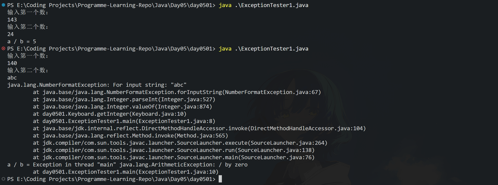
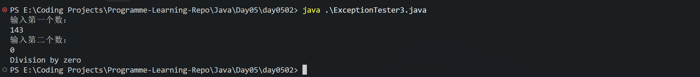
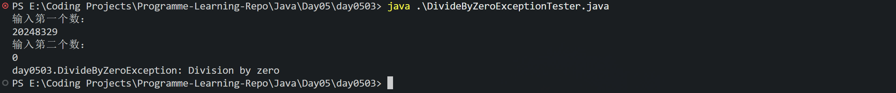
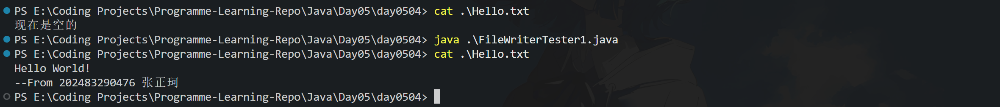
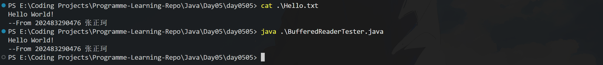

# 南京信息工程大学 实验（实习）报告

实验（实习）名称 <u>错误处理和文件读写</u> 实验（实习）日期 <u>2026/4/30</u> 得分 指导教师 <u>方巍</u>

系 <u>计软院</u> 专业 <u>计算机科学与技术</u> 年级 <u>2024级</u> 班次 6 姓名 <u>张正珂</u> 学号 <u>202483290476</u>

## 一. 实验目的

了解和掌握错误处理和文件读写的基本原理和方法。

## 二. 实验内容

课本第五章 例5-2 5-4 5-7 5-11 5-14

## 三. 实验步骤

0. 编写通用的 KeyBoard.java. 所有实验默认使用该类

```java
package day0501;

import java.io.*;

public class Keyboard {
    static BufferedReader br = new BufferedReader(new InputStreamReader(System.in));

    public static int getInteger() {
        try {
            return (Integer.valueOf(br.readLine().trim()).intValue());
        } catch (Exception e) {
            e.printStackTrace();
            return 0;
        }
    }

    public static String getString() {
        try {
            return br.readLine();
        } catch (IOException e) {
            return "0";
        }
    }
}

```

1. 5-2

- 代码

```java
package day0501;

public class ExceptionTester1 {
    public static void main(String[] args) {
        System.out.println("输入第一个数：");
        int a = Keyboard.getInteger();
        System.out.println("输入第二个数：");
        int b = Keyboard.getInteger();
        System.out.print("a / b = ");
        int res = a / b;
        System.out.println(res);
    }
}

```

- 结果



2. 5-4

- 代码

```java
package day0502;

public class ExceptionTester3 {
    public static void main(String[] args) {
        int a = 0, b = 0, res = 0;

        try {
            System.out.println("输入第一个数：");
            a = Integer.valueOf(Keyboard.getString().trim()).intValue();
            System.out.println("输入第二个数：");
            b = Integer.valueOf(Keyboard.getString().trim()).intValue();
            res = a / b;
        } catch (NumberFormatException e) {
            System.out.println("Invalid input");
            System.exit(-1);
        } catch (ArithmeticException e) {
            System.out.println("Division by zero");
            System.exit(-1);
        }
        System.out.println("a / b = " + res);
    }
}

```

- 结果



3. 5-7

- 代码

```java
// DivideByZeroException.java
package day0503;

public class DivideByZeroException extends ArithmeticException {
    public DivideByZeroException() {
        super("Division by zero");
    }
}

```

```java
// DivideByZeroExceptionTester.java
package day0503;

public class DivideByZeroExceptionTester {
    private static int quoient(int numerator, int denominator) throws DivideByZeroException {
        if (denominator == 0) {
            throw new DivideByZeroException();
        }
        return numerator / denominator;
    }

    public static void main(String[] args) {
        int a = 0, b = 0, res = 0;
        try {
            System.out.println("输入第一个数：");
            a = Integer.valueOf(Keyboard.getString().trim()).intValue();
            System.out.println("输入第二个数：");
            b = Integer.valueOf(Keyboard.getString().trim()).intValue();
            res = quoient(a, b);
        } catch (NumberFormatException e) {
            System.out.println("Invalid input");
            System.exit(-1);
        } catch (DivideByZeroException e) {
            System.out.println(e.toString());
            System.exit(-1);
        }
        System.out.println("a / b = " + res);
    }
}

```

- 结果



3. 5-11

- 代码

```java
package day0504;

import java.io.*;

public class FileWriterTester1 {
    public static void main(String[] args) throws IOException {
        String filename = "./Hello.txt";
        FileWriter fw = new FileWriter(filename);
        fw.write("Hello World!\n");
        fw.write("--From 202483290476 张正珂\n");
        fw.close();
    }
}

```

- 结果



3. 5-14

- 代码

```java
package day0505;

import java.io.*;

public class BufferedReaderTester {
    public static void main(String[] args) throws IOException {
        String filename = "./Hello.txt";
        String line;

        try {
            BufferedReader br = new BufferedReader(new FileReader(filename));
            line = br.readLine();
            while (line != null) {
                System.out.println(line);
                line = br.readLine();
            }
            br.close();
        } catch (IOException e) {
            System.out.println("张正珂没找到文件" + filename + "在哪儿!");
        }
    }
}

```

- 结果



## 四. 体会和总结

通过本次“错误处理和文件读写”实验，我对 Java 程序健壮性的实现方式有了更直观的认识。 总体来看，本次实验帮助我把课堂中的概念转化为可运行代码，提升了调试与排错能力。后续我会继续规范变量命名与异常提示信息，并尝试使用 `try-with-resources` 优化资源管理，使程序更简洁、更安全。
