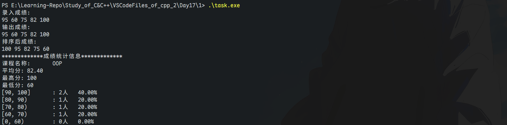
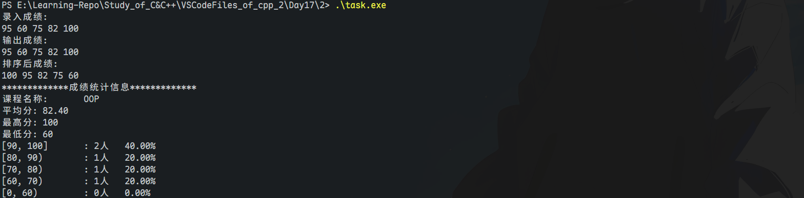
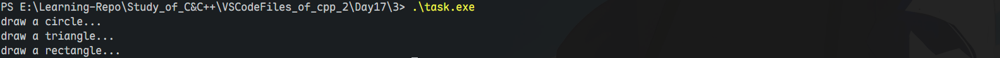
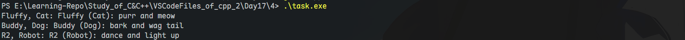

# 任务一

## 组合实现 GradeCalc

### 源码

> GradeCalc.hpp

```cpp
#pragma once

#include <vector>
#include <array>
#include <string>

class GradeCalc
{
public:
    GradeCalc(const std::string &cname);
    void input(int n);                 // 录入n个成绩
    void output() const;               // 输出成绩
    void sort(bool ascending = false); // 排序 (默认降序)
    int min() const;                   // 返回最低分（如成绩未录入，返回-1)
    int max() const;                   // 返回最高分 （如成绩未录入，返回-1)
    double average() const;            // 返回平均分 （如成绩未录入，返回0.0)
    void info();                       // 输出课程成绩信息

private:
    void compute(); // 成绩统计

private:
    std::string course_name;     // 课程名
    std::vector<int> grades;     // 课程成绩
    std::array<int, 5> counts;   // 保存各分数段人数（[0, 60), [60, 70), [70, 80), [80, 90), [90, 100]
    std::array<double, 5> rates; // 保存各分数段人数占比
    bool is_dirty;               // 脏标记，记录是否成绩信息有变更
};
```

> GradeCalc.cpp

```cpp
#include <algorithm>
#include <array>
#include <cstdlib>
#include <iomanip>
#include <iostream>
#include <numeric>
#include <string>
#include <vector>

#include "GradeCalc.hpp"

GradeCalc::GradeCalc(const std::string& cname)
    : course_name{cname}, is_dirty{true} {
    counts.fill(0);
    rates.fill(0);
}

void GradeCalc::input(int n) {
    if (n < 0) {
        std::cerr << "无效输入！人数不能为负数\n";
        std::exit(1);
    }
    grades.reserve(n);
    int grade;
    for (int i = 0; i < n; ) {
        std::cin >> grade;
        if (grade < 0 || grade > 100) {
            std::cerr << "无效输入！分数须在[0,100]\n";
            continue;
        }
        grades.push_back(grade);
        ++i;
    }
    is_dirty = true;
}

void GradeCalc::output() const {
    for (auto grade : grades)
        std::cout << grade << " ";
    std::cout << std::endl;
}

void GradeCalc::sort(bool ascending) {
    if (ascending)
        std::sort(grades.begin(), grades.end());
    else
        std::sort(grades.begin(), grades.end(), std::greater<int>());
}

int GradeCalc::min() const {
    if (grades.empty()) return -1;
    auto it = std::min_element(grades.begin(), grades.end());
    return *it;
}

int GradeCalc::max() const {
    if (grades.empty()) return -1;
    auto it = std::max_element(grades.begin(), grades.end());
    return *it;
}

double GradeCalc::average() const {
    if (grades.empty()) return 0.0;
    double avg = std::accumulate(grades.begin(), grades.end(), 0.0) / grades.size();
    return avg;
}

void GradeCalc::info() {
    if (is_dirty) compute();
    std::cout << "课程名称：\t" << course_name << std::endl;
    std::cout << "平均分:\t" << std::fixed << std::setprecision(2) << average() << std::endl;
    std::cout << "最高分:\t" << max() << std::endl;
    std::cout << "最低分：\t" << min() << std::endl;
    const std::array<std::string, 5> grade_range{"[0, 60)", "[60, 70)", "[70, 80)", "[80, 90)", "[90, 100]"};
    for (int i = grade_range.size() - 1; i >= 0; --i)
        std::cout << grade_range[i] << "\t: " << counts[i] << "人\t"
                  << std::fixed << std::setprecision(2) << rates[i] * 100 << "%\n";
}

void GradeCalc::compute() {
    if (grades.empty()) return;
    counts.fill(0);
    rates.fill(0);
    for (auto grade : grades) {
        if (grade < 60) ++counts[0];
        else if (grade < 70) ++counts[1];
        else if (grade < 80) ++counts[2];
        else if (grade < 90) ++counts[3];
        else ++counts[4];
    }
    for (int i = 0; i < static_cast<int>(rates.size()); ++i)
        rates[i] = counts[i] * 1.0 / grades.size();
    is_dirty = false;
}
```

> demo1.cpp

```cpp
#include <iostream>
#include <string>
#include "GradeCalc.hpp"

void test() {
    GradeCalc c1("oop");
    std::cout << "录入成绩：\n";
    c1.input(5); // 示例输入: 95 60 75 82 100
    std::cout << "输出成绩：\n";
    c1.output();
    std::cout << "排序后成绩：\n";
    c1.sort();
    c1.output();
    std::cout << "*************成绩统计信息*************\n";
    c1.info();
}

int main() {
    test();
    return 0;
}
```

### 结果



### 回答

- 组合成员：`std::vector<int> grades`（存放课程成绩）、`std::array<int,5> counts`（各分数段人数）、`std::array<double,5> rates`（各分数段占比）。
- `c.push_back(97)`不合法。组合方案未暴露`vector<int>`接口，`push_back`不是`GradeCalc`的公有成员。
- 连续打印 3 次统计信息仅首次调用`compute`一次；`is_dirty`用于避免重复计算，数据变更后置脏，统计前刷新。
- 新增`update_grade(index, new_grade)`无需更改`compute`调用位置，但需在更新后将`is_dirty=true`。
- 中位数统计：在`info()`内按需计算即可（不新增成员）。伪代码：`auto t=grades; if(t.empty()) return; nth_element(t.begin(), t.begin()+t.size()/2, t.end()); median=t[t.size()/2]; 输出median;`（偶数可取两中位的均值）。
- 若在`compute`去掉`counts.fill(0); rates.fill(0);`，重复统计会在旧值基础上累加，造成错误（如多次`info()`后结果失真）。
- 去掉`grades.reserve(n)`：功能不受影响；性能上会因多次扩容导致重复分配与拷贝，推高时间与内存搬移成本。

# 任务二

## 继承实现 GradeCalc

### 源码

> GradeCalc.hpp

```cpp
#pragma once

#include <array>
#include <string>
#include <vector>

class GradeCalc : private std::vector<int> {
public:
    GradeCalc(const std::string &cname);
    void input(int n);
    void output() const;
    void sort(bool ascending = false);
    int min() const;
    int max() const;
    double average() const;
    void info();

private:
    void compute();

private:
    std::string course_name;
    std::array<int, 5> counts;
    std::array<double, 5> rates;
    bool is_dirty;
};
```

> GradeCalc.cpp

```cpp
#include <algorithm>
#include <array>
#include <cstdlib>
#include <iomanip>
#include <iostream>
#include <numeric>
#include <string>
#include <vector>

#include "GradeCalc.hpp"

GradeCalc::GradeCalc(const std::string& cname)
    : course_name{cname}, is_dirty{true} {
    counts.fill(0);
    rates.fill(0);
}

void GradeCalc::input(int n) {
    if (n < 0) {
        std::cerr << "无效输入！人数不能为负数\n";
        return;
    }
    this->reserve(n);
    int grade;
    for (int i = 0; i < n; ) {
        std::cin >> grade;
        if (grade < 0 || grade > 100) {
            std::cerr << "无效输入！分数须在[0,100]\n";
            continue;
        }
        this->push_back(grade);
        ++i;
    }
    is_dirty = true;
}

void GradeCalc::output() const {
    for (auto grade : *this)
        std::cout << grade << " ";
    std::cout << std::endl;
}

void GradeCalc::sort(bool ascending) {
    if (ascending)
        std::sort(this->begin(), this->end());
    else
        std::sort(this->begin(), this->end(), std::greater<int>());
}

int GradeCalc::min() const {
    if (this->empty()) return -1;
    return *std::min_element(this->begin(), this->end());
}

int GradeCalc::max() const {
    if (this->empty()) return -1;
    return *std::max_element(this->begin(), this->end());
}

double GradeCalc::average() const {
    if (this->empty()) return 0.0;
    double avg = std::accumulate(this->begin(), this->end(), 0.0) / this->size();
    return avg;
}

void GradeCalc::info() {
    if (is_dirty) compute();
    std::cout << "课程名称：\t" << course_name << std::endl;
    std::cout << "平均分:\t" << std::fixed << std::setprecision(2) << average() << std::endl;
    std::cout << "最高分:\t" << max() << std::endl;
    std::cout << "最低分：\t" << min() << std::endl;
    const std::array<std::string, 5> grade_range{"[0, 60)", "[60, 70)", "[70, 80)", "[80, 90)", "[90, 100]"};
    for (int i = grade_range.size() - 1; i >= 0; --i)
        std::cout << grade_range[i] << "\t:" << counts[i] << "人\t"
                  << std::fixed << std::setprecision(2) << rates[i] * 100 << "%\n";
}

void GradeCalc::compute() {
    if (this->empty()) return;
    counts.fill(0);
    rates.fill(0);
    for (int grade : *this) {
        if (grade < 60) ++counts[0];
        else if (grade < 70) ++counts[1];
        else if (grade < 80) ++counts[2];
        else if (grade < 90) ++counts[3];
        else ++counts[4];
    }
    for (int i = 0; i < static_cast<int>(rates.size()); ++i)
        rates[i] = counts[i] * 1.0 / this->size();
    is_dirty = false;
}
```

> demo2.cpp

```cpp
#include <iostream>
#include <string>
#include "GradeCalc.hpp"

void test() {
    GradeCalc c1("oop");
    std::cout << "录入成绩：\n";
    c1.input(5); // 示例输入: 95 60 75 82 100
    std::cout << "输出成绩：\n";
    c1.output();
    std::cout << "排序后成绩：\n";
    c1.sort();
    c1.output();
    std::cout << "*************成绩统计信息*************\n";
    c1.info();
}

int main() {
    test();
    return 0;
}
```

### 结果



### 回答

- 继承关系：`class GradeCalc : private std::vector<int>`。
- 基类`vector<int>`接口不会自动成为`GradeCalc`公有接口（私有继承），`c.push_back(97)`不能编译通过。
- 组合访问：`for (auto grade : grades)`通过成员容器访问；继承访问：`for (int grade : *this)`通过基类迭代器访问。封装差异决定接口暴露程度。
- 方案选择：成绩计算更适合组合，接口更可控、不泄露底层容器操作，易维护对象不变式；继承（尤其私有继承）较少用于“has-a”。

# 任务三

## 图形打印（组合+继承+虚函数）

### 源码

> Graph.hpp

```cpp
#pragma once

#include <string>
#include <vector>

enum class GraphType { circle, triangle, rectangle };

class Graph {
public:
    virtual void draw() {}
    virtual ~Graph() = default;
};

class Circle : public Graph { public: void draw(); };
class Triangle : public Graph { public: void draw(); };
class Rectangle : public Graph { public: void draw(); };

class Canvas {
public:
    void add(const std::string& type);
    void paint() const;
    ~Canvas();
private:
    std::vector<Graph*> graphs;
};

GraphType str_to_GraphType(const std::string& s);
Graph* make_graph(const std::string& type);
```

> Graph.cpp

```cpp
#include <algorithm>
#include <cctype>
#include <iostream>
#include <string>

#include "Graph.hpp"

void Circle::draw() { std::cout << "draw a circle...\n"; }
void Triangle::draw() { std::cout << "draw a triangle...\n"; }
void Rectangle::draw() { std::cout << "draw a rectangle...\n"; }

void Canvas::add(const std::string& type) {
    Graph* g = make_graph(type);
    if (g) graphs.push_back(g);
}
void Canvas::paint() const { for (Graph* g : graphs) g->draw(); }
Canvas::~Canvas() { for (Graph* g : graphs) delete g; }

GraphType str_to_GraphType(const std::string& s) {
    std::string t = s;
    std::transform(s.begin(), s.end(), t.begin(),
                   [](unsigned char c) { return std::tolower(c); });
    if (t == "circle") return GraphType::circle;
    if (t == "triangle") return GraphType::triangle;
    if (t == "rectangle") return GraphType::rectangle;
    return GraphType::circle;
}

Graph* make_graph(const std::string& type) {
    switch (str_to_GraphType(type)) {
        case GraphType::circle:    return new Circle;
        case GraphType::triangle:  return new Triangle;
        case GraphType::rectangle: return new Rectangle;
        default:                   return nullptr;
    }
}
```

> demo3.cpp

```cpp
#include <string>
#include "Graph.hpp"

void test() {
    Canvas canvas;
    canvas.add("circle");
    canvas.add("triangle");
    canvas.add("rectangle");
    canvas.paint();
}

int main() { test(); return 0; }
```

### 结果



### 回答

- 组合：`std::vector<Graph*> graphs`，`Canvas`组合一组图形以统一绘制。
- 继承：`class Circle : public Graph`、`class Triangle : public Graph`、`class Rectangle : public Graph`。
- 若`Graph::draw`非虚，则`g->draw()`静态绑定，调用基类`draw`，派生行为失效。
- 若`std::vector<Graph*>`改为`std::vector<Graph>`会对象切片，丢失派生部分，导致调用基类行为。
- 若`~Graph()`非虚，`delete Graph*`指向派生对象仅调用基析构，资源泄漏/未定义行为。
- 新增`Star`改动：
  - `Graph.hpp`：新增`class Star : public Graph { void draw(); };`，枚举`GraphType`添加`star`。
  - `Graph.cpp`：实现`Star::draw()`；在`str_to_GraphType`解析`"star"`；在`make_graph`返回`new Star`。
  - `demo3.cpp`：`canvas.add("star");`（可选）。
- 资源管理：堆对象由`Canvas::~Canvas`统一释放。原始指针手动管理易泄漏、异常安全差；建议使用`std::unique_ptr<Graph>`降低风险。

# 任务四

## 玩具工厂

### 源码

> Toy.hpp

```cpp
#pragma once
#include <string>
#include <vector>
#include <memory>
#include <iostream>

enum class ToyType { Cat, Dog, Robot };

class Toy {
public:
    Toy(std::string name_, ToyType type_) : name(std::move(name_)), type(type_) {}
    virtual ~Toy() = default;
    virtual std::string name_str() const { return name; }
    virtual std::string type_str() const {
        switch (type) {
            case ToyType::Cat:   return "Cat";
            case ToyType::Dog:   return "Dog";
            case ToyType::Robot: return "Robot";
            default:             return "Unknown";
        }
    }
    virtual void special() const = 0;
protected:
    std::string name;
    ToyType type;
};

class CatToy : public Toy {
public:
    CatToy(const std::string& n) : Toy(n, ToyType::Cat) {}
    void special() const override { std::cout << name << " (Cat): purr and meow\n"; }
};

class DogToy : public Toy {
public:
    DogToy(const std::string& n) : Toy(n, ToyType::Dog) {}
    void special() const override { std::cout << name << " (Dog): bark and wag tail\n"; }
};

class RobotToy : public Toy {
public:
    RobotToy(const std::string& n) : Toy(n, ToyType::Robot) {}
    void special() const override { std::cout << name << " (Robot): dance and light up\n"; }
};

class ToyFactory {
public:
    void add_cat(const std::string& name)   { toys.emplace_back(std::make_unique<CatToy>(name)); }
    void add_dog(const std::string& name)   { toys.emplace_back(std::make_unique<DogToy>(name)); }
    void add_robot(const std::string& name) { toys.emplace_back(std::make_unique<RobotToy>(name)); }
    void display_all() const {
        for (const auto& t : toys) {
            std::cout << t->name_str() << ", " << t->type_str() << ": ";
            t->special();
        }
    }
private:
    std::vector<std::unique_ptr<Toy>> toys;
};
```

> demo4.cpp

```cpp
#include "Toy.hpp"

int main() {
    ToyFactory factory;
    factory.add_cat("Fluffy");
    factory.add_dog("Buddy");
    factory.add_robot("R2");
    factory.display_all();
}
```

### 结果



### 说明

- 关系：`ToyFactory`组合`std::vector<std::unique_ptr<Toy>>`；`CatToy/DogToy/RobotToy`继承`Toy`并重写特异功能。
- 设计理由：组合聚合资源，继承实现多态。以`unique_ptr`管理资源，避免手动`delete`与泄漏风险。

# \*碎碎念

> 咳咳..
